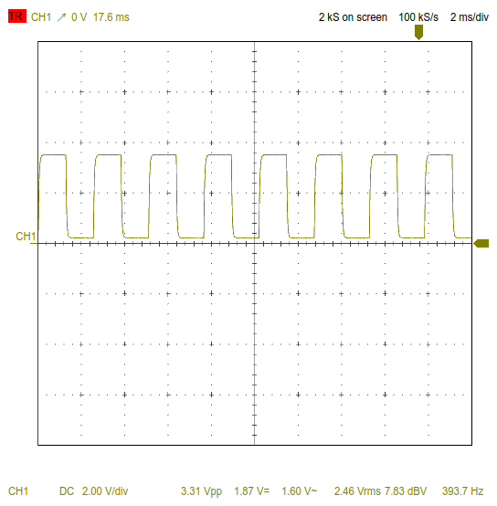

# STM32-Function-Generator
This project implements a **function generator** based on an STM32 microcontroller (H7 series). It allows users to select both waveform type and output frequency using a rotary encoder, keypad, and UART interface.

## 🔧 Hardware Used

- STM32H7 microcontroller (tested on STM32H743)
- DAC1 (analog signal output)
- TIM2 (triggers DAC updates)
- TIM4 (encoder interface for frequency control)
- UART3 (serial communication)
- 16x2 HD44780-compatible LCD
- 4x4 Keypad
- DMA (for efficient waveform data transfer to DAC)

## ⚙️ Features

- Adjustable frequency from **100 Hz to 2000 Hz** via rotary encoder
- Select waveform type via:
  - **UART terminal input**
  - **Keypad buttons ('1' to '4')**
- Real-time display of frequency and waveform selection on LCD
- DAC output via DMA for:
  - Sine Wave
  - Triangle Wave
  - Square Wave
  - Sawtooth Wave

## 📺 LCD Display

- **Line 1**: Selected waveform type
- **Line 2**: Current output frequency (e.g. `Frequency: 1911`)

## 📡 UART Serial Interface

- Baudrate: `115200`
- Periodic prompt shows current frequency and waveform options

## 📈 Available Waveforms

Each waveform contains 128 points and is looped continuously using DMA:
- **Sine Wave** – Smooth periodic waveform

- **Triangle Wave** – Linear rise and fall

- **Square Wave** – 50% duty cycle on/off signal

- **Sawtooth Wave** – Sharp rise followed by a drop

